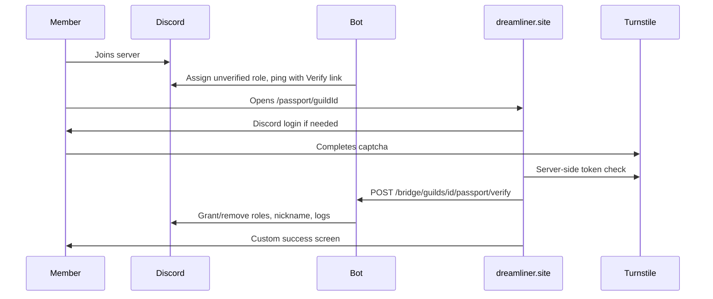
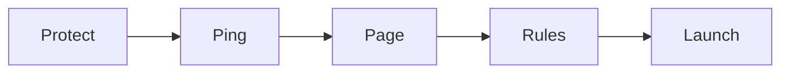

# Passport verification system

Two-repo feature: bot plugin + bridge in [Dreamliner](c:\Users\coal1\OneDrive\Documents\Coal\Dreamliner), public verify page + dashboard editor in [Dreamliner Website](c:\Users\coal1\OneDrive\Documents\Coal\Dreamliner Website).

## What managers can customise

All of this lives in guild YAML `plugins.passport.config` and a dedicated dashboard setup editor (same idea as [WelcomeSetupEditor](c:\Users\coal1\OneDrive\Documents\Coal\Dreamliner Website\src\components\editor\WelcomeSetupEditor.tsx)).

**Gate (what they can see in Discord)**
- `unverified_role_id` — applied on join; use Discord channel perms so they only see the verify channel
- `grant_role_ids` — roles given on success
- `remove_role_ids` — extra roles stripped on success (typically the unverified role)
- `strip_roles_until_verified` — optional hard gate: strip every other role on join until they pass
- `nickname` — optional template on success (`{user_display}`, etc. via existing [templates.ts](src/core/templates.ts))

**Join ping (what they see in the channel)**
- Channel, ping style (`mention` / `none`), content, embed (reuse welcome embed schema), button label/emoji
- Optional DM with the same link
- Optional persistent panel (`/passport panel`) so the channel always has a Verify button
- Delete ping on verify, on leave, and/or after N seconds

**Website page (what they see on the site)**
- Headline, body, rules block, login/verify button labels
- Accent (or inherit `server_accent_color`), background (`none` / `color` / `url` / `guild_banner`)
- Toggles: server icon, server name, member count, signed-in avatar
- Success / already-verified / not-a-member / disabled copy

**Requirements and failure**
- Cloudflare Turnstile (always on for the web step)
- Minimum Discord account age
- `remember_verifications` (default on — rejoins skip the gate)
- `bypass_role_ids` — staff skip
- Timeout: `none` or `kick` after N seconds, with optional timeout DM

Plugin defaults to **disabled**. Bots are ignored.

## Bot repo

New plugin `passport` (display name Passport), category **Protection**.

**Core files**
- [src/config/schemas/passport.ts](src/config/schemas/passport.ts) — Zod config (embeds reused from [welcome.ts](src/config/schemas/welcome.ts))
- [src/plugins/passport/](src/plugins/passport/) — `index.ts`, commands, defaultOverrides, join/leave handlers, ping builder, timeout sweep, store
- Register in [availablePlugins.ts](src/plugins/availablePlugins.ts), [pluginSchemas.ts](src/core/pluginSchemas.ts), [guild.ts](src/config/schemas/guild.ts), [plugins.ts](src/config/schemas/plugins.ts), [helpCategories.ts](src/core/helpCategories.ts), [default.server.yaml](config/default.server.yaml)
- URL helper `getPassportUrl(guildId)` in [docsUrl.ts](src/core/docsUrl.ts)

**Database** (`0032_passport.sql` + tables in [schema.ts](src/db/schema.ts))
- `passport_pending` — join time, ping message/channel, expiry
- `passport_verifications` — completed records (for remember + staff lookup)

**Join flow**
1. Skip bots, disabled plugin, bypass roles, or remembered verification
2. Optionally strip roles; apply unverified role
3. Post ping (and optional DM) with Link button to `/passport/{guildId}`
4. Store pending; `onLoad` interval kicks expired pending members (same pattern as [infraction/index.ts](src/plugins/infraction/index.ts))

**Verify completion** (bridge → plugin)
- Confirm still in guild, plugin enabled, captcha already trusted by the site
- Enforce account age; apply grant/remove roles + nickname via [safeAddRole](src/core/roles.ts)
- Delete/edit ping; log `passport_verify` / `passport_kick` via [emitLog](src/core/logging/send.ts)
- Add those event types in [events.ts](src/core/logging/events.ts)

**Commands** (level ≥50 defaults: `can_panel`, `can_force`, `can_revoke`, `can_test`)
- `/passport panel` — post persistent Verify message
- `/passport test` — preview ping as yourself
- `/passport force` / `/passport revoke` — staff grant or undo
- `/passport status` — pending / verified lookup

**Bridge** ([dashboardBridge.ts](src/bridge/dashboardBridge.ts) + new `src/bridge/webPassport.ts`)

These routes use Bearer secret like other site calls. They must **not** require Manage Server.

- `GET /bridge/guilds/:id/passport` — public page payload (enabled, guild branding, page copy, theme). Website still sends Bearer; bot does not check `memberCanManage`.
- `POST /bridge/guilds/:id/passport/verify` — `{ userId }` from Auth.js session. Bot checks membership and completes verification.
- `POST /bridge/guilds/:id/passport/test-ping` — dashboard-only, **does** require Manage Server.
- `POST /bridge/guilds/:id/passport/panel` — dashboard Launch step; posts the persistent Verify message to the configured channel. Requires Manage Server.

Wire the new path matchers into the existing guild-route allowlist in `dashboardBridge.ts` (the `if (!publicGuildMatch && …)` block around line 742).

## Website repo

**Public flow** at `/passport/[guildId]`
- Mirror [server/[guildId]/page.tsx](c:\Users\coal1\OneDrive\Documents\Coal\Dreamliner Website\src\app\server\[guildId]\page.tsx): validate snowflake, fetch page payload, apply accent CSS vars
- New `signInForPassport(guildId)` with `redirectTo: /passport/{guildId}` (today [dashboard/actions.ts](c:\Users\coal1\OneDrive\Documents\Coal\Dreamliner Website\src\app\dashboard\actions.ts) always redirects to `/dashboard`)
- Client panel: Discord login → Turnstile widget → POST `/api/passport/[guildId]/verify`
- API route: session `discordId` + Turnstile siteverify, then `completePassportVerification()`
- Helpers in [botBridge.ts](c:\Users\coal1\OneDrive\Documents\Coal\Dreamliner Website\src\lib\botBridge.ts)

**Captcha:** Cloudflare Turnstile (`NEXT_PUBLIC_TURNSTILE_SITE_KEY`, `TURNSTILE_SECRET_KEY` in website `.env.example` only).

**Dashboard setup (walkthrough, not a field dump)**

Passport gets a dedicated `PassportSetupEditor` — a linear 5-step wizard, not the generic YAML field list. Hide every passport config key from the generic `settingKeys` loop in [ConfigEditor.tsx](c:\Users\coal1\OneDrive\Documents\Coal\Dreamliner Website\src\components\editor\ConfigEditor.tsx) (same pattern as Welcomer / Scam Protect). Keep the existing Enabled toggle + permission overrides below the wizard.

Layout: numbered pill stepper on top (reuse the Welcomer `.welcome-tabs` track/pill look, but numbered with a check when the step is complete). One step on screen at a time. Short title + one-line help. Back / Continue at the bottom. Sticky live preview on the right for Ping and Page. Generous whitespace, few primary fields, everything else behind an **Advanced** disclosure.

**Step 1 — Protect** (what they can see in Discord)
- Verify channel
- Unverified role (applied on join)
- Verified role(s) granted on success
- One-line hint: give Unverified access only to this channel in Discord
- Advanced: extra roles to strip, strip-all-until-verified, nickname template

Complete when: channel + unverified role + at least one grant role are set.

**Step 2 — Ping** (what they see when they join)
- Message content + optional embed (reuse Welcomer embed controls, collapsed by default)
- Button label
- Toggles: mention them, also DM, delete ping after verify
- Live Discord-message preview (reuse [DiscordMessagePreview](c:\Users\coal1\OneDrive\Documents\Coal\Dreamliner Website\src\components\editor\WelcomeSetupEditor.tsx) patterns)
- Advanced: ping style, delete on leave / after N seconds, persistent-panel note

Complete when: content or embed is non-empty (sensible defaults pre-filled so this is usually already done).

**Step 3 — Page** (what they see on the site)
- Headline, body, verify button label
- Accent (inherit server accent by default) + background
- Live **website card preview** (server icon, headline, body, fake captcha/button) so they see the member experience while editing
- Advanced: rules block, show/hide icon/name/count/avatar, success / already-verified / not-a-member copy

Complete when: headline is set (defaulted).

**Step 4 — Rules**
- Remember verifications (default on)
- Minimum account age (off by default, simple duration picker)
- If they don't finish: do nothing / kick after duration
- Advanced: bypass roles, timeout DM text

Complete always (defaults are valid).

**Step 5 — Launch**
- Readiness checklist with green/grey ticks (channel, unverified role, verified role, plugin enabled)
- Copy verify URL
- Post persistent panel to the verify channel
- Send a test ping to yourself
- Quiet note: Discord still owns channel overwrites — Unverified must only see the verify channel
- If anything is missing, Continue is replaced by a disabled primary and the checklist points back to the step

Visual rules for `.passport-setup` in [globals.css](c:\Users\coal1\OneDrive\Documents\Coal\Dreamliner Website\src\app\globals.css):
- No nested `dash-block` soup — one canvas, stepper, then a single card for the active step
- Incomplete step numbers are muted; complete steps show a check; active is white pill on `--dash-track`
- Preview pane is a quiet phone/Discord mock, not a second settings column
- Primary button is only Continue / Post panel / Send test — never a wall of equal-weight actions
- Mobile: stepper scrolls horizontally; preview stacks under the form

Do not add `/passport` to `robots.ts` disallow (page is public) and do not add per-guild URLs to the sitemap.

## Discord setup managers still own

The unverified role only hides channels if Discord permissions say so. Docs will tell managers: create Unverified, allow it only on the verify channel, deny it (or deny @everyone) everywhere else. Passport will not auto-rewrite every channel overwrite.

## Docs

- [docs/plugins/passport.md](docs/plugins/passport.md) + index under Protection in [docs/plugins/README.md](docs/plugins/README.md)
- Cover autorole / member-identity interaction: if `remember_verifications` is off, disable identity role restore or turn on `strip_roles_until_verified`
