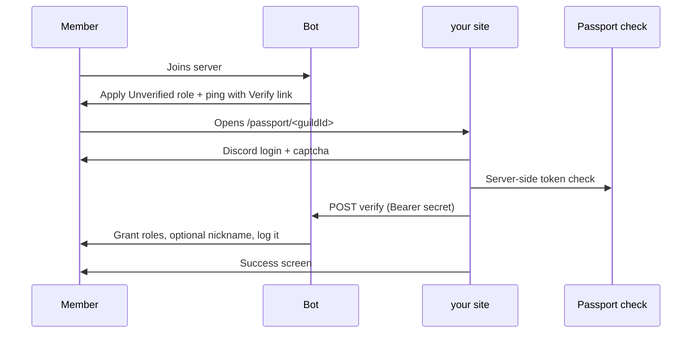

# Passport plugin

Passport is a fully customisable verification gate. New members are held behind an **Unverified** role, pinged in a verify channel, and sent to a public website where they sign in with Discord and pass Dreamliner's own captcha. When they pass, Dreamliner grants the roles you choose.

Passport is **off by default**. Bots are always ignored.

## How it works



1. A member joins. Passport applies the **Unverified** role (and optionally strips their other roles).
2. Passport posts a **join ping** in the verify channel with a **Verify** link button (and optionally a DM).
3. The member opens the site, signs in with Discord, and completes the captcha.
4. The website verifies the captcha server-side, then tells the bot over the dashboard bridge.
5. Dreamliner grants the configured roles, removes the Unverified role, optionally sets a nickname, deletes the ping, and logs `passport_verify`.
6. The success screen lists exactly what the member gained: every role they were given, plus the nickname if one was applied.
7. If a member never verifies, an optional timeout can kick them (logged as `passport_kick`).

## The captcha

Passport ships its own captcha, so there is no third-party widget, no extra keys, and nothing loaded
from another domain.

The member gets a small grid and a prompt such as *Select every compass*. Each tile is drawn on the
server as a one-off SVG with randomised rotation, skew, scale, ink, paper and background clutter, and
the browser only ever receives opaque ids. Nothing in the page or the image names what a tile
depicts, so a script has to actually recognise the pictures.

It is also cheap to fail and expensive to guess:

- The number of correct tiles changes every time, so the answer space isn't fixed.
- A grid is burned on the first answer, right or wrong, so nobody retries the same board.
- A pass token works once and expires after ten minutes.
- Issuing and answering are both rate limited per client.
- Each new grid asks for a different icon than the one before it.

## Setup (dashboard)

Open **Passport** in the dashboard for a guided five-step wizard:

1. **Protect** — pick the verify channel, the Unverified role, and the role(s) granted on success.
2. **Ping** — write the join message and Verify button, with a live Discord preview.
3. **Page** — customise the website headline, body, accent, and background, with a live page preview.
4. **Rules** — remember verifications, set a minimum account age, and choose an optional kick-on-timeout.
5. **Test** — run a health check, try the flow yourself, and post the persistent panel.

Finally, toggle **Enabled** on for the guild.

## Testing before real members hit it

The **Test** tab opens with a health check that reads your live Discord state, so you find broken
wiring here rather than on your next join. It reports:

- Passport is enabled, and Dreamliner has Manage Roles.
- Dreamliner can View, Send, and Embed in the verify channel.
- The Unverified and reward roles exist, aren't integration-managed, and sit **below** Dreamliner's
  highest role.
- The Unverified role can actually see the verify channel — and **can't** see anything else, which is
  the mistake that quietly lets newcomers walk straight in.
- Kick Members when the timeout action is a kick, and Manage Nicknames when a nickname template is set.

Alongside it are three safe actions that only ever target you: send yourself the real join ping, walk
the live Passport page from start to finish (this clears your own verification so you can redo it),
and post the persistent verify panel. After you finish, **Test again** on the success screen starts
another run. Your Discord roles are left alone.

## Discord permissions you still own

Passport does **not** rewrite channel overwrites. The Unverified role only hides channels if your Discord permissions say so:

- Create an **Unverified** role.
- Allow it to view **only** the verify channel.
- Deny it (or deny `@everyone`) elsewhere so newcomers can't see the rest of the server until they pass.

## Configuration

```yaml
plugins:
  passport:
    enabled: false
    config:
      channel_id: ""            # verify channel (pings + panel)
      unverified_role_id: ""    # applied on join
      grant_role_ids: []        # granted on success
      remove_role_ids: []       # extra roles stripped on success
      strip_roles_until_verified: false
      nickname: ""              # optional template on success
      ping:
        enabled: true
        ping_style: mention     # mention | none
        content: "Hey {user}, welcome to **{guild}**.\n\nTap **Verify** to unlock the rest of the server."
        button_label: "Verify"
        also_dm: false
        delete_on_verify: true
        delete_on_leave: true
        delete_after_seconds: 0
        embed: { enabled: false }
      panel:
        content: "Welcome to **{guild}**.\n\nTap **Verify** to unlock the rest of the server."
        button_label: "Verify"
        embed: { enabled: false }
      page:
        headline: "Welcome to {guild}"
        body: "Sign in with Discord and complete a quick check to prove you're human."
        rules: ""
        inherit_accent: true
        background: none         # none | color | url | guild_banner
        show_server_icon: true
        show_server_name: true
        show_member_count: true
        show_user_avatar: true
      remember_verifications: true
      min_account_age_seconds: 0
      bypass_role_ids: []
      timeout_action: none       # none | kick
      timeout_seconds: 0
      timeout_dm: ""
```

| Field | Description |
|-------|-------------|
| `channel_id` | Channel where join pings and the persistent panel are posted |
| `unverified_role_id` | Role applied on join, removed on success |
| `grant_role_ids` | Roles granted after a successful verification |
| `remove_role_ids` | Extra roles removed on success (the unverified role is always removed) |
| `strip_roles_until_verified` | Strip every non-managed role on join until they pass (hard gate) |
| `nickname` | Optional nickname template applied on success (supports placeholders) |
| `ping.*` | Join ping: style, content, embed, button, DM, and deletion rules |
| `panel.*` | Persistent Verify panel content and button |
| `page.*` | Website copy, accent, background, visibility toggles, and success / already-verified / not-a-member / disabled screens |
| `remember_verifications` | Returning members who already verified skip the gate |
| `min_account_age_seconds` | Reject Discord accounts younger than this (0 = off) |
| `bypass_role_ids` | Members with any of these roles skip Passport entirely |
| `timeout_action` / `timeout_seconds` | Optionally `kick` members who don't verify in time |
| `timeout_dm` | Optional DM sent before a timeout kick |

## Commands

| Command | Permission | Description |
|---------|------------|-------------|
| `/passport panel` | `can_panel` | Post a persistent Verify panel in the verify channel |
| `/passport test` | `can_test` | Send yourself a preview of the join ping |
| `/passport force <user>` | `can_force` | Mark a member as verified |
| `/passport revoke <user>` | `can_revoke` | Undo a member's verification and re-apply the gate |
| `/passport status <user>` | `can_test` | Show a member's pending / verified state |

Default grants: level **50+** for all four permissions.

## Requirements

- Bot needs **Manage Roles** (and its role must sit above the granted/unverified roles).
- Bot needs **Kick Members** if you use the timeout kick.
- The website must be configured with the dashboard bridge secret. Passport uses Dreamliner's own captcha (no third-party widget).

## Logs

- `passport_verify` — a member completed verification (website or `/passport force`).
- `passport_kick` — a member was kicked for not verifying in time.

Both are moderation-category events; enable them in the [Logs](./logs.md) plugin.

## Interaction with other plugins

- **Autorole / Member identity:** if `remember_verifications` is off, a returning member could have roles restored by autorole/member-identity before they re-verify. Either keep `remember_verifications` on, disable identity role restore, or turn on `strip_roles_until_verified` so the gate wins on rejoin.
